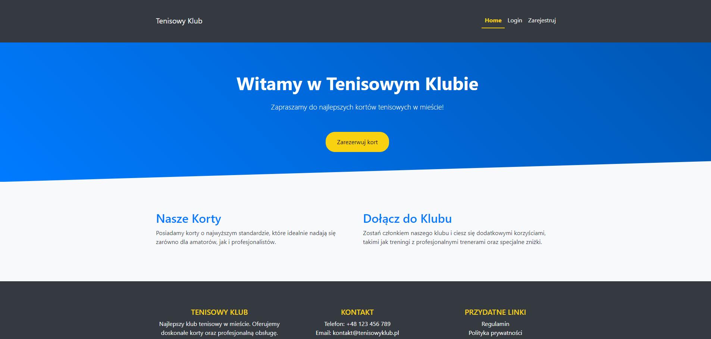
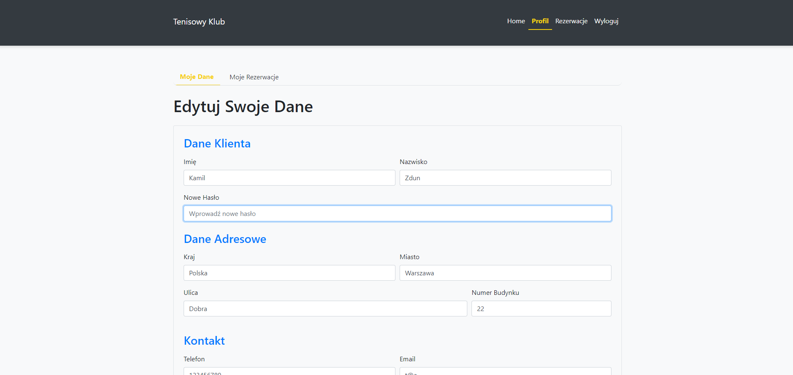
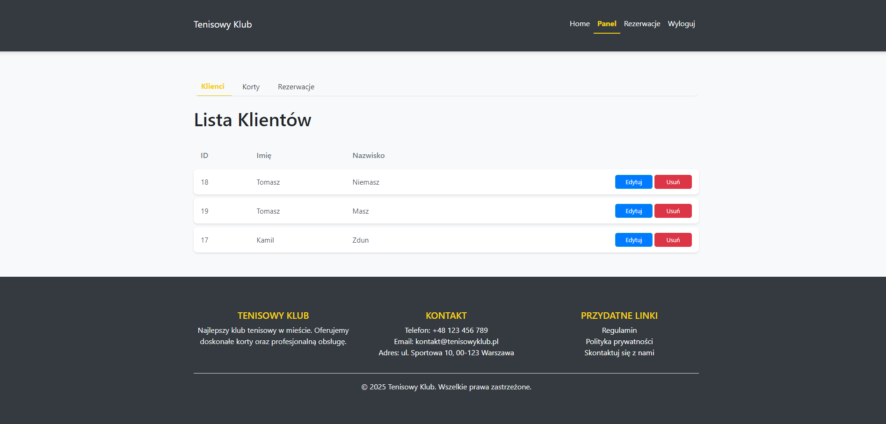
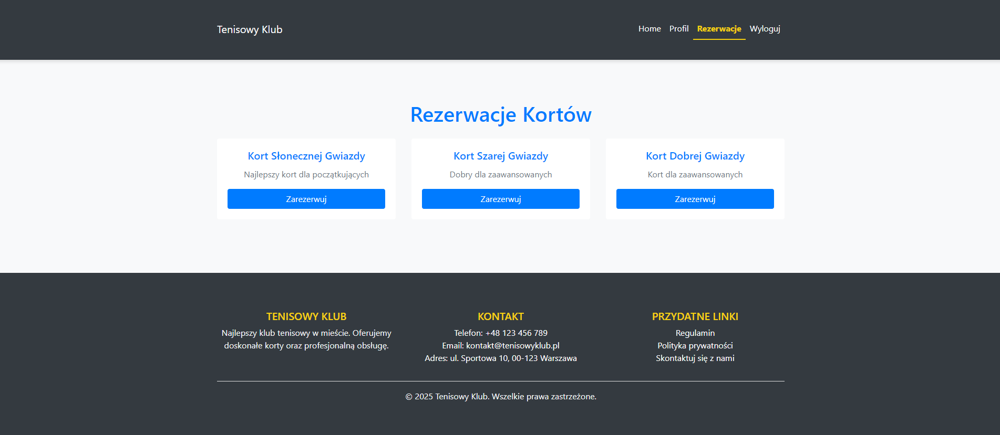

# 🎾 **Tennis Court Booking System**  
> Aplikacja do rezerwacji kortów tenisowych napisana w **Java Spring**  

  
  
  

---

## 📌 **Opis projektu**  
Aplikacja pozwala użytkownikom na rezerwowanie kortów tenisowych oraz zarządzanie nimi. Posiada podział na użytkowników oraz administratorów, którzy mają możliwość edycji rezerwacji i zarządzania kortami.  

## ✨ **Technologie**  
🔹 **Backend:** Java, Spring Boot, Spring Security, Spring JDBC, Spring Beans  
🔹 **Frontend:** HTML, CSS  
🔹 **Baza danych:** Oracle  

---

## 🚀 **Funkcjonalności**  
✅ **Rejestracja i logowanie** użytkowników (Spring Security)  
✅ **Rezerwacja kortów tenisowych** przez użytkowników  
✅ **Zarządzanie rezerwacjami** (usuwanie, edycja)  
✅ **Panel administratora:**  
   - Zarządzanie użytkownikami  
   - Zarządzanie kortami  
   - Edycja i usuwanie rezerwacji  

---

## 🔧 **Uruchamianie projektu**  
Aby uruchomić aplikację lokalnie, wykonaj poniższe kroki:  

1️⃣ **Sklonuj repozytorium**  
   ```bash
   git clone https://github.com/twoj-login/TennisCourtBooking.git
   cd TennisCourtBooking
   ```
2️⃣ **Skonfiguruj bazę danych**  
   Upewnij się, że baza danych Oracle działa i odpowiednie parametry są ustawione w `application.properties`.  

3️⃣ **Uruchom aplikację**  
   ```bash
   mvn spring-boot:run
   ```
4️⃣ **Otwórz aplikację w przeglądarce**  
   ```
   http://localhost:8080
   ```

## 📸 **Zrzuty ekranu**  
| Strona główna | Panel użytkownika | Panel administratora | Rezerwacje |
|--------------|----------------|----------------|
|  |  |  |  |
